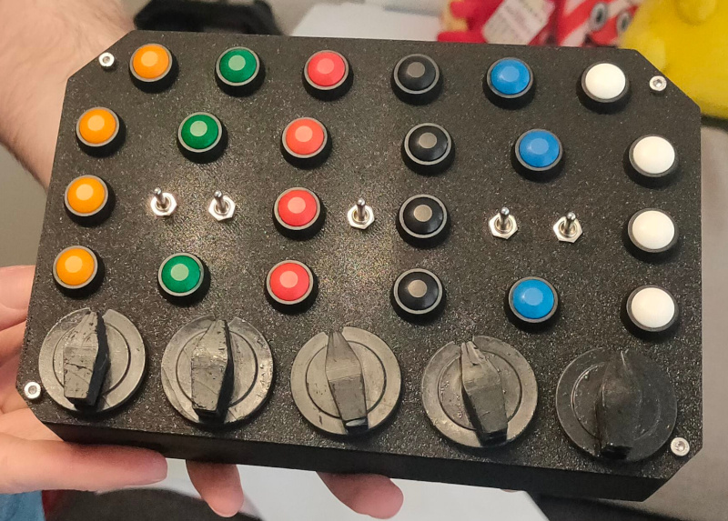

Linux/Windows compatible Button Box for e.g. Simracing
======================================================

- [Linux/Windows compatible Button Box for e.g. Simracing](#linuxwindows-compatible-button-box-for-eg-simracing)
- [Introduction](#introduction)
- [About this example](#about-this-example)
  - [CircuitPython](#circuitpython)
  - [Files](#files)
    - [boot.py](#bootpy)
    - [code.py](#codepy)
    - [joystick.py](#joystickpy)
  - [GND Buttons](#gnd-buttons)
  - [Button Matrix](#button-matrix)
  - [Rotary Encoders](#rotary-encoders)
  - [Extending - more Buttons or analogue Axes](#extending---more-buttons-or-analogue-axes)
- [My Use-Case](#my-use-case)
- [Linux - SDL2 vs. hidraw in Proton](#linux---sdl2-vs-hidraw-in-proton)
  - [Initial setup](#initial-setup)
  - [For each game](#for-each-game)

# Introduction
This is an example for a Button Box based on:
* [CircuitPython](https://circuitpython.org/)
* a Microcontroller board such as [Raspberry Pi Pico](https://www.raspberrypi.com/products/raspberry-pi-pico/)
* any count of Pushbuttons (closing when pushed)
* any count of momentary Toggle Switches
* any count of Rotary Encoders

It presents itself as USB Joystick to Linux or Windows and may be used in games as desired.

This is not a guide on how to build and solder your own Button Box, but an overview on what you could do, how CircuitPython could be leveraged and which materials you would need.

# About this example
## CircuitPython
[CircuitPython](https://circuitpython.org/) has to be flashed on the board.

Developed & tested with version [8.2.9](https://github.com/adafruit/circuitpython/releases/tag/8.2.9), but may very well be compatible to newer versions.

Only one [additional library](https://circuitpython.org/libraries) is required and has to be installed:
* [Adafruit HID Library](https://docs.circuitpython.org/projects/hid/en/latest/)
## Files
After installing CircuitPython, libraries and copying the example to your board, it should look like this
```
lib/
    adafruit_hid/
       ...
boot.py
code.py
joystick.py
```
### boot.py
This file is executed after connecting the board to power.

It creates the necessary USB HID Joystick, defines a name for the device and disables development access as this is not required for regular use.

By default the code that disables serial is commented out to prevent an accidental locking out via simple copy-pasting. Once development is done or a Pushbutton is defined and connected as "Escape", this section can be enabled safely.
### code.py
This file is executed after `boot.py` and after the USB connection has been established with the USB host (e.g. Linux/Windows).

It is the main loop that is executed permanently, scans for pressed buttons/toggled switches/turned encoders and announces them to the USB host.

Here all pins are defined as well - these may be completely different to your own build Button Box and Use-Case, so change accordingly.
### joystick.py
This file contains the interfacing logic used by `code.py` which is to send USB HID compliant reports to the USB host.

It uses the USB HID Joystick that was created in `boot.py` beforehand.
## GND Buttons
As the name suggests, these are Buttons that are connected to a dedicated pin on the board and GND. One button therefore requires one dedicated pin.

This example uses this technique only for an "Escape" Pushbutton, as a Button Matrix is more efficient.
## Button Matrix
A Button Matrix reduces the amount of pins required for multiple Pushbuttons.

Pins are used as Rows and Columns and for each combination of the two, one Pushbuttons can be used. So for 6 Rows and 6 Columns thats a total of 36 Pushbuttons being connected to only 12 pins on the board.

I recommended to add 1N4148 diodes to each Pushbutton to prevent "ghost" presses as described by [Nick Gammon](https://www.gammon.com.au/forum/?id=14175).
## Rotary Encoders
The builtin library [rotaryio](https://docs.circuitpython.org/en/latest/shared-bindings/rotaryio/index.html) is used to interpret the Rotary Encoders.

They are used as endless rotary switches - so they have no position "0" or "10" that could be mapped to a function (e.g. a specific engine map) in a game. Instead they represent 2 buttons and each turn of the encoder clicks the button that is assigned to the used direction.

Each Encoder is connected as follows:
* A (Clockwise) -> Pin on the board
* B (Counterclockwise) -> Next pin after A on the board. It is not possible to use pins that are not in a sequential order to each other.
* C -> GND

Examples for a [Raspberry Pi Pico](https://www.raspberrypi.com/documentation/microcontrollers/raspberry-pi-pico.html):
* Correct: A -> "GP0" and B -> "GP1"
* Incorrect: A -> "GP22" and B -> "GP26"
## Extending - more Buttons or analogue Axes
For this you'll have to read into USB HID specification as for incorrect USB HID definitions in boot.py you'll receive no explainatory error messages. OSError "USB busy" may be raised, when the USB host (e.g. Linux/Windows) does not accept the definition.

But in short, you'd have to:
* modify `JOYSTICK_REPORT_DESCRIPTOR` in `boot.py` and add Usage Pages as required for your desired extension
  * more buttons would be the most simple change, as the current Usage Page would only have to be changed: "Usage Maximum" & "Report Count"
  * for axes [the examples here may help](https://learn.adafruit.com/customizing-usb-devices-in-circuitpython/hid-devices)
  * remember to add padding via an additional Usage Page to whole bytes, if e.g. defining "78" Buttons - which would be 78/8 = 9 byte 6 bit and require a 2 bit padding
* increase `in_report_lengths` in `boot.py` to the sum of bytes of all Usage Pages in `JOYSTICK_REPORT_DESCRIPTOR`
* modify `joystick.py` to support the new buttons/axes and send them in the USB report
  * for axes take a look at this example: https://github.com/adafruit/Adafruit_CircuitPython_HID/blob/6.0.3/examples/hid_gamepad.py

# My Use-Case
I've wanted to have a lot of Pushbuttons, some Toggle Switches and multiple Rotary Encoders for Simracing (AMS2) and Simdriving (BeamNG.drive).
* Pushbuttons are useful for e.g. requesting pitstops, switching camera perspektives or cranking the starter motor
* momentary Toggle Switches are useful for e.g. cycling differential modes or turn signals
* Rotary Encoders are useful for e.g. increasing/decreasing brake bias, engine maps, TC levels or ABS levels

Therefore you'll see pin definitions in `code.py` for:
* 1 "Escape" Pushbutton, that is connected against GND and enables serial console for development, as this will be disabled by default
* a 6x6 Button Matrix for 36 buttons
  * 21 of these are Pushbuttons in my case
  * 10 of these are two-way momentary Toggle Switches (so 5 Toggle Switches)
  * 5 of these are Rotary Encoders, that can be pushed momentarily just like a Pushbutton
* 5 Rotary Encoders
  * each has clockwise and counterclockwise functionality that are both assigned each to a button
    * rotating a Rotary Encoder in a direction issues a button press & release in software
  * I use ALPS STEC11B09 as these have only 20 detents (20 "clicks" in full rotation). They use a 1:1 ratio of pulses and detents. So for each detent you feel while turning, one full pulse is given, which is then used as a button click. Basically: 1 Rotary Encoder "click" equals 1 button click
    * these also have the mentioned Pushbutton feature and can be clicked instead of turned

Below my result with unsanded, unpainted Encoder Knob Prototypes - just as a hint how it all could look like:



# Linux - SDL2 vs. hidraw in Proton
By default Proton uses SDL2, which is a library designed to, among other things, standardize gamepad/joystick usage.
This may lead to SDL2 mapping your Button Box to XBox-like buttons and hiding all other buttons. So it reduces your button count.
In games these buttons will be named XBox-style (A, B, X, Y, ...) and all other buttons will simply not work.

If you encounter this issue and want all your buttons to work, SDL2 has to be disabled for the USB device (e.g. a Button Box).

Proton supports hidraw without SDL2: https://github.com/ValveSoftware/Proton/blob/proton-8.0-5/docs/CONTROLLERS.md

Therefore we just tell it to use hidraw instead of SDL2.

## Initial setup
Find Vendor Id and Product Id of the USB device
```bash
lsusb
Bus 001 Device 008: ID 239a:80f4 Adafruit Button Box v1
```
Here in this example, `239a` is the Vendor Id while `80f4` is the Product Id

Create appropriate udev rule in file `/etc/udev/rules.d/60-steam.rules` (use your own Vendor Id & Product Id):
```
RPi Pico Button Box v1
KERNEL=="hidraw*", ATTRS{idVendor}=="239a", ATTRS{idProduct}=="80f4", MODE="0660", TAG+="uaccess"
```

Reload udev rules
```bash
udevadm control --reload-rules && udevadm trigger
```

## For each game
Use e.g. following line as launch command in game options (right-click properties of game in steam) to switch to hidraw (use your own Vendor Id & Product Id):
`PROTON_ENABLE_HIDRAW=0x239a/0x80f4 %command%`

Additionally, if the game was run before already, all registry entries have to be deleted from `<steam_library_folder>/steamapps/compatdata/<steam_game_app_id>/pfx/system.reg`.

All blocks (seperated by empty lines) have to be removed, where "vid_<VID>" and "pid_<PID>" are defined, so e.g. "vid_239a" and "pid_80f4".
